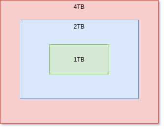

# Local Backup Automation Utility

This is a simple backup utility which I use to automate my backups.    

    

     


## Installation

```bash
git clone https://github.com/jadia/backup-utility.git && \
cd backup-utility
```

## How to Use   

### Synchronize hard-disk

```bash
Usage:   ./main.sh --OPTION <SOURCE> <DESTINATION>
Example: ./main.sh --sync 1tb 2tb
         ./main.sh --remove 1tb

Options:
    --sync : Backup data from smaller driver to bigger
        Only below combinations are allowed:
        1tb -> 2tb
        2tb -> 4tb

    --remove : Remove a drive safely
        Unmount the partition and power off the device
        Only below inputs are allowed:
        1tb, 2tb & 4tb
```

### Backup Laptop Data

```bash
Usage: ./laptop_backup.sh
```


## Resources   
<!-- 
https://stackoverflow.com/a/36851784    
https://medium.com/capital-one-tech/bashing-the-bash-replacing-shell-scripts-with-python-d8d201bc0989      
https://github.com/rackbrains/automate-ssh-key-rotation-with-ansible/blob/master/bin/rotate-keys.sh    
-->
